# jarkom-modul-2-A07-2021

## no. 8

Setelah melakukan konfigurasi server, maka dilakukan konfigurasi Webserver. Pertama dengan webserver www.franky.yyy.com. Pertama, luffy membutuhkan webserver dengan DocumentRoot pada /var/www/franky.yyy.com

### Jawab

● Pada Skypie
1. Install paket yang diperlukan terlebih dahulu (Masukkan pada /root/.bashrc)
pada Skpie masukkan

``
 vim /root/.bashrc
``
kemudian copy

``
echo nameserver 192.172.122.1 > /etc/resolv.conf
apt-get update
apt-get install apache2 -y
apt-get install php -y
apt-get install libapache2-mod-php7.0 -y
apt-get install nano
apt-get install unzip -y
apt-get install wget -y
``
setelah itu jalankan menggunakan ``bash /root/.bashrc`` pada terminal Skypie

2. Masukkan perintah buat directory, download file yang ingin di download di command.sh, pindahkan file yang di download ke directory yang sudah ditentukan, dan lakukan copy pada 000-default.conf ke franky.a07.com.conf.
Pada terminal skypie jalankan perintah vim ``command.sh``
kemudian masukkan:
``
mkdir /var/www/franky.A07.com
wget https://raw.githubusercontent.com/FeinardSlim/Praktikum-Modul-2-Jarkom/main/franky.zip
unzip franky.zip
mv franky/home.html /var/www/franky.A07.com
mv franky/index.php /var/www/franky.A07.com
cp /etc/apache2/sites-available/000-default.conf /etc/apache2/sites-available/franky.A07.com.conf
``
setelah itu pada terminal Skypie jalankan dengan perintah ``bash command.sh``

.png)

3. Lakukan edit franky.A07.com.conf, pada kasus ini kami buat script bernama general-script.sh dengan comand v``im franky.A07.com.conf`` dan melakukan perintah seperti berikut:
``
echo '<VirtualHost *:80>
 
            ServerAdmin webmaster@localhost
            ServerName franky.A07.com
            ServerAlias www.franky.A07.com
            DocumentRoot /var/www/franky.A07.com
 ErrorLog ${APACHE_LOG_DIR}/error.log
 CustomLog ${APACHE_LOG_DIR}/access.log combined
</VirtualHost>' > /etc/apache2/sites-available/franky.A07.com.conf
``
setelah itu jalankan dengan perintah bash ``franky.A07.com.conf``

4. Aktifkan konfigurasi franky.A07.com dengan menggunakan perintah 
``
cd /etc/apache2/sites-available
a2ensite franky.A07.com.conf
``
pada terminal Skypie
5. Restart apache2 pada terminal Skypie dengan commmand
``service apache2 restart``
● Pada Loguetown dan Alabasta
   1. install lynx dengan perintah ``vim /root/.bashrc`` yang kemudian masukkan commmand berikut di dalamnya
``
echo nameserver 192.172.122.1 > /etc/resolv.conf
apt-get update
apt-get install sudo
apt-get install nano
apt-get install dnsutils -y
apt-get install lynx -y
``
2. Buka franky.A07.com dengan perintah
``
lynx franky.A07.com
``

.png)

## no.9

Setelah itu, Luffy juga membutuhkan agar url www.franky.yyy.com/index.php/home dapat menjadi menjadi www.franky.yyy.com/home

### Jawab

● Pada Skypie
   1. Pada no9.sh di beri perintah terlebih dahulu dengan ``vim no9.sh``, setelah itu  edit .htaccess pada index.php di dalamnya.
``
echo '<VirtualHost *:80>
 
            ServerAdmin webmaster@localhost
            ServerName franky.A07.com
            ServerAlias www.franky.A07.com
            DocumentRoot /var/www/franky.A07.com
 
            <Directory /var/www/franky.A07.com>
            Options +FollowSymLinks -Multiviews
            AllowOverride All
            </Directory>
 ErrorLog ${APACHE_LOG_DIR}/error.log
 CustomLog ${APACHE_LOG_DIR}/access.log combined
</VirtualHost>' > /etc/apache2/sites-available/franky.A07.com.conf
 
echo 'RewriteEngine On
RewriteCond %{REQUEST_FILENAME} !-d
RewriteCond %{REQUEST_FILENAME} !-f
RewriteRule ^home$ /index.php/home
' > /var/www/franky.A07.com/.htaccess
``
kemudian jalankan dengan perintah bash ``no9.sh``

   2.  Setelah itu a2enmod franky.A07.com.conf
   3. Lakukan restart dengan service apache2 restart
● Pada Loguetown dan Alabasta
Lakukan ``lynx franky.A07.com/home``

.png)

## no. 10

Setelah itu, pada subdomain www.super.franky.yyy.com, Luffy membutuhkan penyimpanan aset yang memiliki DocumentRoot pada /var/www/super.franky.yyy.com

### Jawab

● Pada Skypie
   1. Pada command2.sh beri perintah vim command2.sh, dengan langkah membuat directory terlebih dahulu, setelah itu mendownload file zip dan meng unzip file tersebut.Lalu dilakukan pemindahan data dari super.franky ke super.franky.A07.com. Setelah itu lakukan copy pada 000-default.conf dengan command berikut
`` 
mkdir /var/www/super.franky.A07.com
wget https://raw.githubusercontent.com/FeinardSlim/Praktikum-Modul-2-Jarkom/main/super.franky.zip
unzip super.franky.zip

mv super.franky/error /var/www/super.franky.A07.com
mv super.franky/public /var/www/super.franky.A07.com
cp /etc/apache2/sites-available/000-default.conf /etc/apache2/sites-available/super.franky.A07.com.conf
``
kemudian jalankan dengan ``bash comman2.sh``
1. Edit file franky.A07.super dengan perintah ``vim franky.A07.super`` kemudian masukkan kode berikut ke dalam franky.A07.super tersebut
``
echo '<VirtualHost *:80>
    ServerAdmin webmaster@localhost
    ServerName super.franky.A07.com
    ServerAlias www.super.franky.A07.com
    DocumentRoot /var/www/super.franky.A07.com
 ErrorLog ${APACHE_LOG_DIR}/error.log
 CustomLog ${APACHE_LOG_DIR}/access.log combined
</VirtualHost>' > /etc/apache2/sites-available/super.franky.A07.com.conf
kemudian dijalankan dengan perintah bash franky.A07.super
``
2. Setelah itu lakukan ``a2ensite super.franky.A07.com`` pada terminal Skypie
3. restart node dengan comand ``service apache2 restart``
● Pada EniesLobby
   1. Lakukan konfigurasi pada zone super.franky.A07.com
   2. Lakukan restart bind9 dengan command
   ``
        Service bind9 restart
    ``
● Pada Loguetown dan Alabasta
   1. Lakukan ``lynx www.super.franky.yyy.com``
   
.png)

## no. 11

Akan tetapi, pada folder /public, Luffy ingin hanya dapat melakukan directory listing saja

### Jawab

 ●       Pada Skypie
1. Lakukan edit pada super.franky.A07.com.conf dengan command ``vim super.franky.A07.com.conf`` kemudian  tambahkan kode berikut
   
    ``
        <Directory /var/www/super.franky.A07.com/public>
            Options +Indexes
        </Directory>
    ``
2. Lakukan ``a2ensite super.franky.A07.com.conf``
3. Lakukan perintah service apache2 restart
 
●       Pada Loguetown dan Alabasta
1. lynx super.franky.A07.com/public

.png)

## no. 12

Tidak hanya itu, Luffy juga menyiapkan error file 404.html pada folder /error untuk mengganti error kode pada apache

### Jawab

●       Pada Skypie
1. Lakukan edit pada super.franky.A07.com.conf dengan command ``vim super.franky.A07.com.conf`` kemudian  tambahkan kode berikut
   ``ErrorDocument 404 /error/404.html``
2.   Lakukan ``a2ensite super.franky.A02.com.conf``
3.   Lakukan perintah ``service apache2 restart``
●       Pada Loguetown dan Alabasta
1. kemudian lakukan ``lynx super.franky.A07.com/(apapun yang salah)``

## no. 13

Luffy juga meminta Nami untuk dibuatkan konfigurasi virtual host. Virtual host ini bertujuan untuk dapat mengakses file asset www.super.franky.yyy.com/public/jsmenjadi www.super.franky.yyy.com/js

### Jawab

●       Pada Skypie
1. Lakukan edit pada super.franky.A07.com.conf dengan command vim super.franky.A07.com.conf kemudian  tambahkan kode berikut
``
    	Alias "/js" "/var/www/super.franky.A07.com/public/js"
``
2. Lakukan ``a2ensite super.franky.A07.com.conf``
3. Lakukan perintah ``service apache2 restart``
●       Pada Loguetown dan Alabasta
4. lakukan ``lynx super.franky.A07.com/js``

.png)

## no. 14

Luffy meminta untuk web www.general.mecha.franky.yyy.com hanya bisa diakses dengan port 15000 dan port 15500.

### Jawab

Pertama-tama di skypie, pada folder `/etc/apache2/sites-available`, copy file `000-default.conf` ke file bernama `general.mecha.franky.A07.com.conf`. Lalu file `general.mecha.franky.A07.com.conf` ditambahkan `<VirtualHost *:15000 *:15500>`, `ServerName general.mecha.franky.A07.com`, `ServerAlias www.general.mecha.franky.A07.com`, dan `DocumentRoot /var/www/general.mecha.franky.A07.com`. 

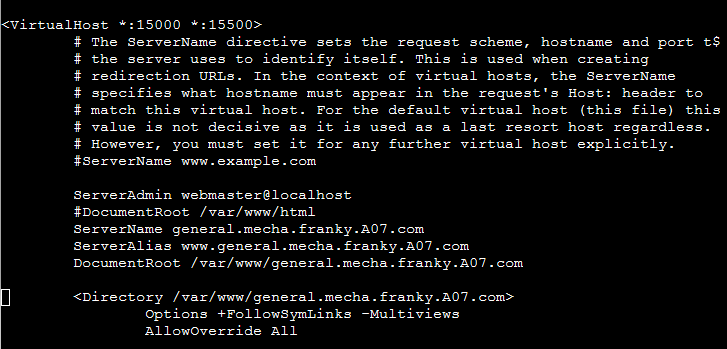

Kemudian tambahkan port 15000 dan 15500 pada file `/etc/apache2/ports.conf` dengan menambahkan:

```
    Listen 15000
    Listen 15500
```

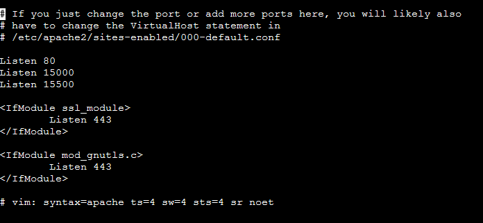

Kemudian digunakan command `mkdir /var/www/general.mecha.franky.A07.com` untuk membuat directory baru dengan nama `general.mecha.franky.A07.com` pada `/var/www/`. lalu copy isi dari folder `general.mecha.franky` ke `/var/www/general.mecha.franky.A07.com`. Setelah itu general.mecha.franky tadi perlu di a2ensite dengan command `a2ensite general.mecha.franky.A07.com` lalu di `service apache2 restart`

untuk mencobanya di LogueTown, digunakan command `lynx http://192.172.2.4:15000` dan `lynx http://192.172.2.4:15500`. Hasilnya dengan kedua port tersebut akan terakses general.mecha.franky.A07.com tersebut.

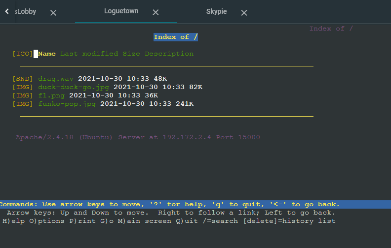

## no. 15

dengan authentikasi username luffy dan password onepiece dan file di /var/www/general.mecha.franky.yyy

### Jawab

Untuk authentikasi login, pertama jalankan command `htpasswd -c /etc/apache2/.htpasswd luffy` untuk menyimpan username dan password kedalam file `/etc/apache2/.htpasswd` dengan user `luffy`, lalu akan muncul prompt untuk memasukkan dan mengkonfirmasi password.

Kemudian, edit file `/etc/apache2/sites-available/general.mecha.franky.A07.com.conf` dengan menambahkan:

```
    <Directory /var/www/general.mecha.franky.A07.com>
        Options +FollowSymLinks -Multiviews
        AllowOverride All
    </Directory>
```
hal ini berguna untuk mengoveride default sitenya.

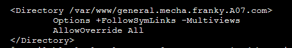

Lalu, edit file `/var/www/general.mecha.franky.A07.com/.htaccess` menjadi:

```
    AuthType Basic
    AuthName "Restricted Content"
    AuthUserFile /etc/apache2/.htpasswd
    Require valid-user
```
Dengan ini, sebelum site terakses, akan diminta username yang dinama disini dipakai "luffy" dan password "onepiece"

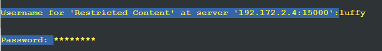


## no. 16

Dan setiap kali mengakses IP EniesLobby akan diahlikan secara otomatis ke www.franky.yyy.com

### Jawab

pertama-tama edit file `/var/www/html/.htaccess` dengan menambahkan:

```
    RewriteEngine On
    RewriteBase /
    RewriteCond %{HTTP_HOST} ^192\.172\.2\.4$
    RewriteRule ^(.*)$ http://www.franky.A07.com [L,R=301]
```

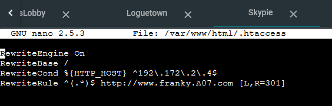

Kemudian, edit file `/etc/apache2/sites-available/000-default.conf` dengan menambahkan:

```bash
    <Directory /var/www/html>
        Options +FollowSymLinks -Multiviews
        AllowOverride All
    </Directory>
```
hal ini berguna untuk mengoveride default sitenya.

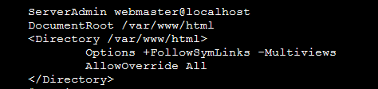

untuk mencobanya di LogueTown, digunakan command `lynx http://192.172.2.4` lalu akan terakses franky.A07.com dari akses ip tersebut.

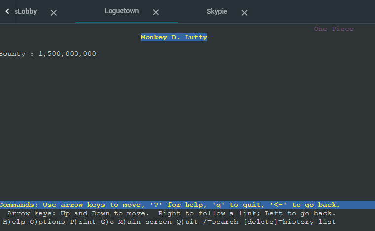

## no. 17

Dikarenakan Franky juga ingin mengajak temannya untuk dapat menghubunginya melalui website www.super.franky.yyy.com, dan dikarenakan pengunjung web server pasti akan bingung dengan randomnya images yang ada, maka Franky juga meminta untuk mengganti request gambar yang memiliki substring “franky” akan diarahkan menuju franky.png.

### Jawab

Pertama, edit file `/etc/apache2/sites-available/super.franky.A07.com.conf` dengan menambahkan:

```
    <Directory /var/www/super.franky.A07.com>
        Options +FollowSymLinks -Multiviews
        AllowOverride All
    </Directory>
```

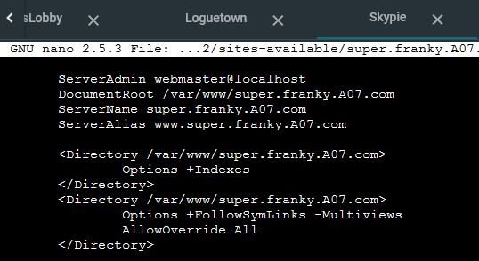

Kemudian, edit file `/var/www/super.franky.A07.com/.htaccess` dengan menambahkan:

```
    RewriteEngine On
    RewriteRule ^(.*)franky(.*)(jpg|gif|png)$ http://super.franky.A07.com/public/images/franky.png [L,R]
```

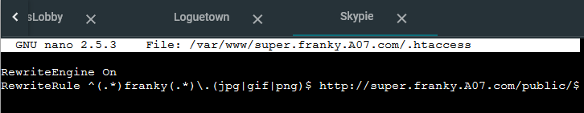

untuk mencobanya di LogueTown, digunakan command `lynx www.super.franky.A07.com/public/images/franky.jpg` dan semua image di `www.super.franky.A07.com/public/images/` akan
terakses ke `lynx www.super.franky.A07.com/public/images/franky.jpg`.

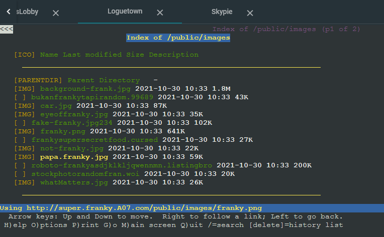

